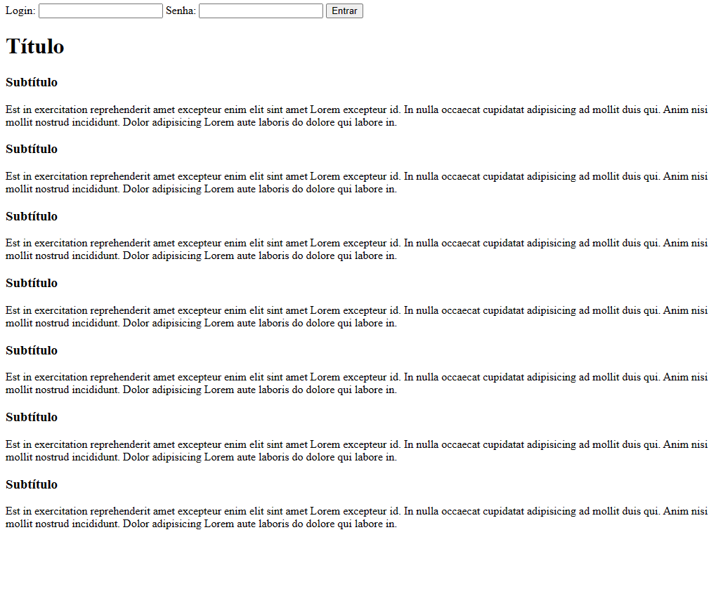
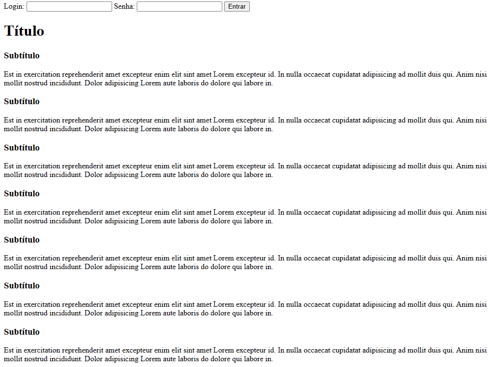

# Exercicíos

## 1 - HTML

### Faça páginas HTML de acordo com cada uma das images:

- a.

- b.

- c.

## 2 -Javascript

### Abra o console do navegador e faça algorítimos que atendem os seguites requisitos:

- a. Faça um algorítimo que calcule a soma de 2 números.

- b. Faça um algorítimo que calcule a subtração de 2 números.

- c. Faça um algorítimo que calcule a área de um cubo cujo cada lado tem 50 cm (Para calcular a área de um cubo precisa-se multiplar um de seus lados por outro).

- d. Faça um algorítimo que calcule o perímetro do mesmo cubo anterior. (Para calcular o perímetro do cubo precisa-se somar cada um de seus lados).

- e. Faça um algorítimo que calcule a área de um parelelepípedo cuja base tem 30 cm e a altura tem 70cm (Para calcular a área de um paralelepípedo precisa-se multiplar a base vezes a altura).

- f. Faça um algorítimo que calcule o perímetro do paralelepípedo anterior.

- g. Faça um algorítimo que calcule a área de um triângulo de base 50cm e altura 100cm. (A área de um triângulo é definida por (base\*altura)/2 )

- g. Faça um algorítimo que receba o primeiro nome de uma pessoa, depois receba o último e em seguida o nome do meio. No final você precisa armazenar os nomes em uma únca string(os nomes precisam ter espaços entre si).

### Bônus

- h. Crie um algorítimo que calcule as raízes da seguinte equação do segundo grau: (x^2 + 2x - 15 = 0)
  Obs: Pode se utilizar o método "Fórmula de Bhaskara". A função (ax^2 + bx -c = 0) Você pode passar variáveis para a,b e c.
  Calcule o valor de delta = b^2 - 4*a*c
  Caso delta seja maior que zero, então calcula-se as raízes:
  A primeira: (-b + delta)/2 - a
  A segunda = (-b - delta)/2 - a
